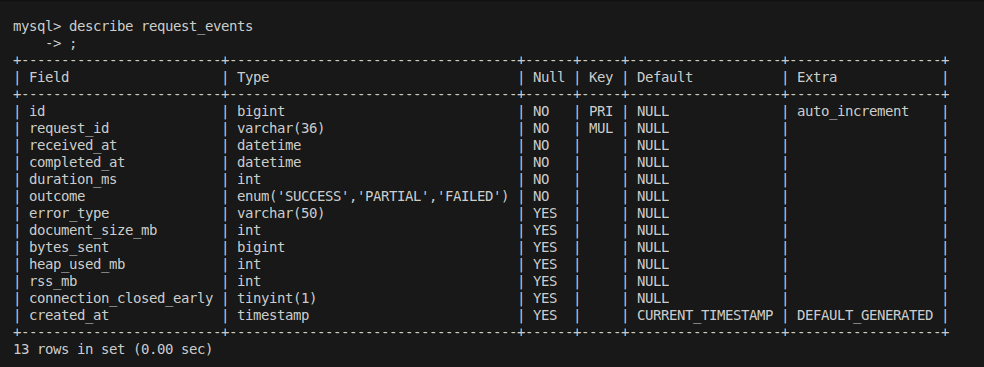
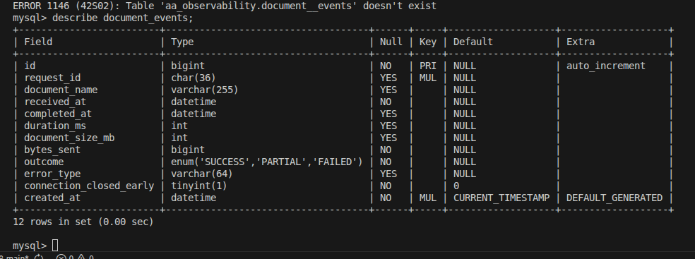

# aa-aggregation

<!-- Day 1 -->
I started by creating a standalone Document API that allocates raw bits to simulate a PDF payload. While testing its upper limits, I observed that allocating more than ~512 MB of string data consistently causes the API to crash and return a 500 Internal Server Error along with "Cannot allocate string longer than Ox1ffffffe8 characters", which is 512 MB. This helped establish a practical memory ceiling for large binary-like responses.

Next, I implemented a Statement API that accepts a count parameter and generates that many random JSON objects, which are then written to a JSON file. During edge-case testing, I found that each JSON object is approximately 250–300 bytes in size. Based on this, the system starts hitting limits around 1e6 to 1e7 records which also validates the 512 MB claim, and a similar behavior was observed for the Analytics API.

After that, I built an Aggregation API that combines responses from the three internal APIs. I tested multiple size combinations to identify the first failure point. The most consistent failure I could reproduce was an Out Of Memory (OOM) error whenever the total aggregated JSON size exceeded ~512 MB, which resulted in a 512 / server-side memory error.

I attempted to reproduce the “truncated response” issue by experimenting with buffer sizes and rate limits. So far, I have not been able to consistently reproduce truncation in this setup. Although I sometimes see early connection close logs, inspecting the tail of the generated JSON files and their sizes shows that they are usually complete.

<!-- Day 2 -->

When I used Promise.all to call all three APIs in parallel, the only reproducible failure mode was OOM. However, when I serialized the API calls (one after another), I was able to occasionally observe truncated responses when the process crashed mid-serialization.

Apart from backend-side failures, this design also has several production risks:

- The client machine may not be able to load such large responses and may itself run into OOM issues.
- CDNs and reverse proxies often enforce maximum buffer or body size limits, which can cause the response to be dropped or truncated.
- Very large payloads significantly increase response time, increasing the probability of timeouts and connection resets.

The only viable solution so far in terms of payload management is to stream the data into the JSON, and then stream that into the PDF generaotor, and subsequently stream the PDF to the client in small chunks so that we dont receive an OOM.

First experiment was to stream the aggregated API, which worked fine for smaller paylaods but once again, encountered the same issue where I was received a string too long error.

This meant that along with streaming the entire API, i must also stream the incoming document API instead of loading the entire API, secondly I was initally converting it into a base 64 string which was creating excessive memory in the V8 buffer, so to solve that, instead of sending a JSON string, I sent  a raw binary buffer reducing the payload size by 1.33 times

After this change, I was able to successfully send payloads as large as 40 GB, which is likely far more than any single client would realistically receive. The next challenge is to understand how this pipeline will behave in a real production environment where failures can occur at multiple stages.

After stabilizing the backend, I also added compression in the document stream and verified end-to-end behavior by building a small frontend to test client-side handling. Files as large as 1 GB were successfully transferred and rendered which I think is more than enough.

Added db schemas for auditabiltiy and telemetry logging, this is the schema for statement and analytics API

This is the schema for document API
